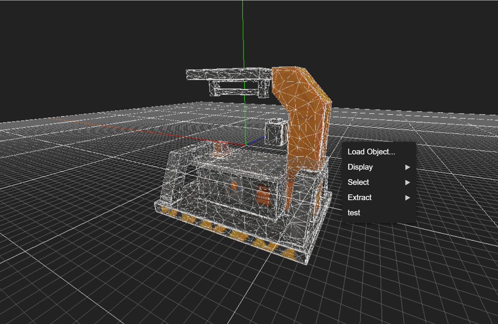

# MultiblockBench


An interactive **3D modeling and geometry manipulation tool** built with **TypeScript**, **Three.js**, and **Vite**.  
The system provides a modular pipeline for loading, editing, and extracting geometry data with extensible sub-geometry management, advanced buffer handling, and UI integration.

[](https://bangbiu.github.io/MultiblockBench/)


## Features
- **Geometry Abstraction Layer**: Unified representation of vertices, edges, and faces through `BenchGeometry`.
- **Sub-Geometry Operations**: Coplanar detection, edge loop extraction, and optimization.
- **Primitives Framework**: Custom geometry generators (`point`, `line`, `faces`) in addition to standard Three.js primitives.
- **Canonicalization & Merging**: Indexed geometry canonicalization and vertex deduplication utilities.
- **Interactive UI**: Context menus, checkboxes, radio options, and dynamic menus for geometry operations.
- **Pen Tool (BenchPen)**: Interactive point placement with snapping to grid planes, undo/redo, and plane manipulation.
- **Rendering Pipeline**: Custom renderer with orbit controls, lighting presets, and grid helpers.
- **OBJ/MTL Import**: Multi-file asset loading and arrangement for efficient mesh reconstruction.


## Tech Stack

| Layer        | Technologies |
|--------------|--------------|
| Languages    | TypeScript, HTML5, CSS3 |
| Bundler      | Vite with ES Modules |
| 3D Engine    | Three.js |
| Shaders      | GLSL ES 3.0 (custom vertex/fragment pipelines) |
| Styling      | CSS3 (flexbox, grid, gradients, backdrop filters) |
| UI           | Native DOM API, ContextMenu framework |
| Fonts/Icons  | Inter, Playfair Display, Devicon |

## Technical Details

The following table enumerates **algorithms and core utilities** implemented in the codebase:

| File | Algorithm / Utility | Description |
|------|---------------------|-------------|
| **DataUtil.ts** | `BenchIterable`, `IndexIterable` | Abstract iterable with `map`, `forEach`, and index-based access for geometry references:contentReference[oaicite:0]{index=0}. |
| | `BenchObject.updateValues` | Dynamic property assignment from partial values. |
| **BenchGeometry.ts** | `BenchGeometry.buildFrom` | Constructs vertex/edge/face structures from indexed buffer geometry:contentReference[oaicite:1]{index=1}. |
| | `BenchFace.neighbors` | Neighbor detection via edge traversal. |
| | `BenchEdge.attachFace` | Topology linking of edges to faces. |
| | `BenchVertex.keyOf` | Canonical key hashing for vertex deduplication. |
| **SubGeometries.ts** | `EdgeLoop` constructor | Adjacency graph walk to construct edge loops:contentReference[oaicite:2]{index=2}. |
| | `EdgeLoop.optimize` | Eliminates collinear vertices using cross product thresholding. |
| | `Coplane` | BFS flood-fill of faces based on coplanarity check. |
| **Primitives.ts** | `PointGeometry`, `VerticesGeometry`, `EdgesGeometry`, `FacesGeometry` | Custom BufferGeometry generators for low-level primitives:contentReference[oaicite:3]{index=3}. |
| | `tubeFromLoop` | Generates tube geometry around an edge loop using Catmull-Rom curves. |
| **GeometryUtil.ts** | `combineGroupGeometries` | Flattens hierarchical object geometry with world transforms:contentReference[oaicite:4]{index=4}. |
| | `canonicalize` | Re-indexes vertices into canonical form with hashing. |
| | `extractSubMesh` | Selective mesh extraction preserving vertex attributes. |
| | `isCoplanar` | Plane alignment and tolerance-based coplanarity check. |
| | `Line3D.closestPointTo` | Projection of a point onto infinite 3D line. |
| **BenchMenu.ts** | `ContextMenu`, `CheckBoxOption`, `RadioButtonOption`, `SubMenuOption` | Modular context menu system with hierarchical actions and input states:contentReference[oaicite:5]{index=5}. |
| **BenchPen.ts** | `WorkPlane` | Rotatable/shiftable workplane with grid helpers:contentReference[oaicite:6]{index=6}. |
| | `ControlPoints` | Interactive control point system with indicator and undo stack. |
| | `BenchPen.onPointerMove` | Raycasting and snapping indicator to grid plane intersections. |
| **main.ts** | `App` lifecycle | Bootstraps renderer, camera, lighting, model, and GUI:contentReference[oaicite:7]{index=7}. |
| | `App.registerEvents` | Centralized event system for mouse, keyboard, and context menu. |

## Dev Environment

- **Editor**: Visual Studio Code with TypeScript support.
- **Build Tool**: Vite (`vite.config.ts` configured for ESM build pipeline).
- **Linting/Formatting**: ESLint + Prettier for consistent coding style.
- **Testing**: Manual geometry validation and runtime debugging via in-scene overlays.
- **Hot Reloading**: Enabled via Vite development server.


## Dependencies

- **three** – Core 3D engine.
- **three-stdlib** – Extended utilities (`mergeBufferGeometries`, `mergeVertices`).
- **Vite** – Development bundler with ESM pipeline.
- **TypeScript** – Strongly-typed language for maintainable code.
- **ESLint / Prettier** – Code quality and formatting.

## Setup
```bash
# Clone the repository
git clone https://github.com/Bangbiu/MultiblockBench.git
cd MultiblockBench

# Install dependencies
npm install

# Start development server
npm run dev

# Build production output
npm run build
```

## Acknowledgements

- **Meshy.AI** – The test 3D model assets used during development are powered by Meshy.AI.
- **Three.js Contributors** – For the foundational 3D rendering library.
- **Open-source Ecosystem** – Including `three-stdlib` for extended geometry manipulation utilities.

## License
MIT